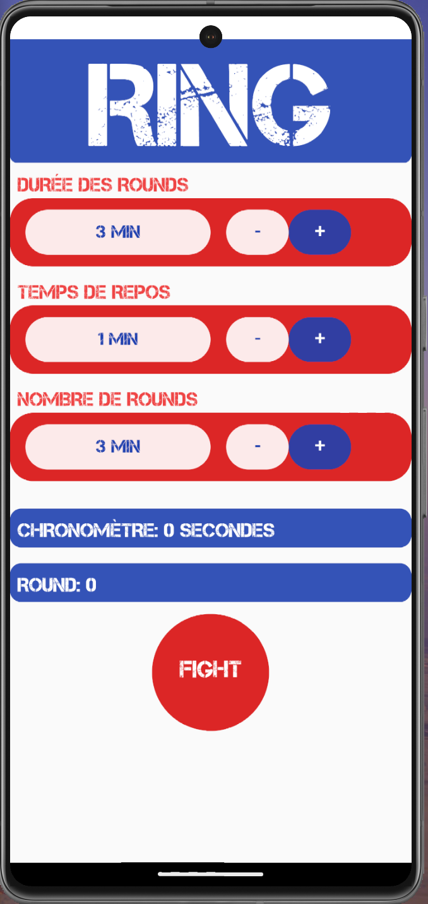

# expo-reactNative-Ring

# Ring - Application de gestion de timer pour les sports de combat

## Présentation

Ring est une application mobile développée en utilisant Expo et React Native qui vous permet de gérer facilement un timer pour les rounds de sports de combat tels que la boxe, le MMA, le kickboxing, etc. 

## Fonctionnalités

- Réglage personnalisé du temps de chaque round.
- Configuration du temps de pause entre les rounds.
- Sonneries et alertes pour indiquer le début et la fin de chaque round.
- Compteur visuel pour suivre le temps restant dans le round en cours.

## Captures d'écran

## Installation

1. Assurez-vous d'avoir Node.js et Expo CLI installés sur votre ordinateur.
2. Clonez ce dépôt sur votre machine.

git clone https://github.com/SebOfWeb/expo-reactNative-Ring.git

3. Accédez au répertoire du projet.

4. Installez les dépendances.
=> npm i

5. Lancez l'application.
=> npm run start

6. Scannez le code QR avec l'application Expo Go sur votre appareil mobile pour tester l'application en direct.

## Utilisation

1. Lancez l'application sur votre appareil mobile.
2. Configurez les paramètres du timer en spécifiant la durée des rounds et des pauses.
3. Appuyez sur "Démarrer" pour lancer le timer.
4. L'application émettra des alertes sonores pour indiquer le début et la fin de chaque round.
5. Suivez votre session d'entraînement et restez concentré.

## Contributions

Les contributions sont les bienvenues ! Si vous souhaitez contribuer à l'amélioration de Ring, veuillez créer une issue pour discuter des fonctionnalités que vous aimeriez ajouter ou soumettre une demande de fusion (pull request) avec vos modifications.

## Licence

Ce projet est sous licence MIT. Consultez le fichier [LICENSE](LICENSE) pour plus de détails.

---

Nous espérons que Ring vous sera utile pour vos entraînements de sports de combat. Si vous avez des questions ou des commentaires, n'hésitez pas à nous contacter.

Bonne séance d'entraînement !
